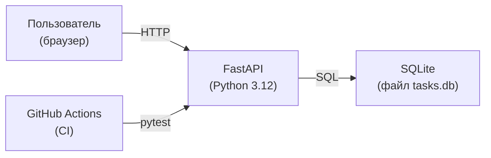

# Архитектурный обзор — TaskFlow

## Компоненты системы

## Описание компонентов

### FastAPI (Backend)

- REST API: CRUD для задач (`/tasks`)
- Хранение через встроенный `sqlite3`

### SQLite

- Один файл `tasks.db` рядом с приложением
- Не требует отдельного сервера
