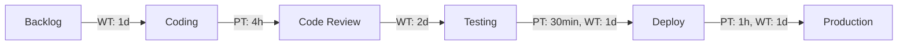

# Анализ потока создания ценности (AS-IS)

## VSM-карта

## Описание этапов

### 1. Backlog → Coding
- **Wait Time:** 1 день (приоритизация, планирование спринта)
- **Processing Time:** —
- **Проблема:** нет чёткого критерия готовности задачи к взятию в работу

### 2. Coding
- **Processing Time:** 4 ч (написание кода, unit-тесты)
- **Wait Time:** —
- **Артефакт:** Pull Request

### 3. Code Review
- **Processing Time:** 1 ч
- **Wait Time:** 2 дня **УЗКОЕ МЕСТО**
- **Проблема:** нет SLA на ревью, ревьюеры заняты своими задачами

### 4. Testing
- **Processing Time:** 30 мин
- **Wait Time:** 1 день
- **Проблема:** тестирование запускается вручную после мёржа

### 5. Deploy
- **Processing Time:** 1 ч **УЗКОЕ МЕСТО**
- **Wait Time:** 1 день (ожидание "окна деплоя")
- **Проблема:** деплой полностью ручной, требует доступа к серверу

## Итоговые метрики

| Метрика | Значение |
|---------|---------|
| **Total Lead Time** | ~6 дней |
| **Total Processing Time** | ~5.5 ч |
| **Total Wait Time** | ~5 дней |
| **Process Efficiency** | ~11% |

## Выявленные узкие места

1. **Code Review (WT: 2 дня)** — внедрить SLA: ревью в течение 24ч; настроить автоматические напоминания
2. **Ручной деплой (PT: 1ч + WT: 1д)** — автоматизировать через GitHub Actions CI/CD pipeline
