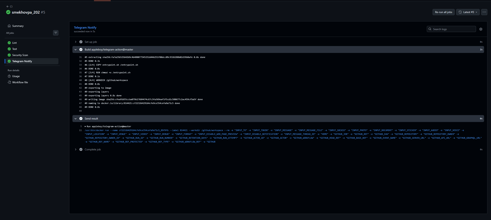

# TaskFlow — Практика 202

## CI/CD Pipeline

Конфигурация пайплайна: [`.github/workflows/ci.yml`](https://github.com/MrLobotomist/special-barnacle/blob/main/.github/workflows/ci.yml)

Пайплайн запускается при каждом push и открытии PR в `main`. Этапы: **Lint → Test → Security Scan**.

**Скриншот успешного прохождения (Green Build):**

## Сравнение с VSM (Практика 201)

По данным VSM из задания 201, этап **Code Review** занимал ~2 дня ожидания при 1 часе реальной работы.

После внедрения CI:

| Этап | Было (VSM) | Стало |
|------|-----------|-------|
| Ожидание ревью | 2 дня | сокращается: пайплайн (~3 мин) даёт мгновенную обратную связь до ревью |
| Ручное тестирование | 30 мин + 1 день ожидания | 0 — автоматически в пайплайне |
| Ручной деплой | 1 ч + 1 день ожидания | заготовлен фундамент для CD |

Автоматические проверки занимают **~3 минуты** против **2+ дней** суммарного ожидания — сокращение цикла обратной связи в ~100 раз.
