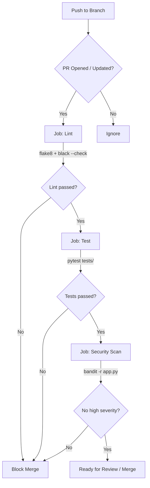

# Логика CI-пайплайна

## Схема пайплайна

## Описание этапов

### Job: Lint

**Триггер:** каждый PR в `main` и push в `main`

| Шаг | Инструмент | Что проверяет |
|-----|-----------|---------------|
| flake8 | `flake8 app.py tests/` | PEP8: длина строк, неиспользуемые импорты, синтаксис |
| black | `black --check app.py tests/` | Единообразное форматирование кода |

Этап блокирует следующие jobs при ошибке (`needs: lint`).

### Job: Test

**Зависимость:** lint должен пройти

| Шаг | Команда | Результат |
|-----|---------|-----------|
| pytest | `pytest tests/ -v` | Запускает 6 unit-тестов через `TestClient` FastAPI |

Тесты используют `tmp_path` + `monkeypatch` — изолированная БД на каждый прогон, не затрагивает `tasks.db`.

### Job: Security Scan

**Зависимость:** test должен пройти

| Шаг | Команда | Что проверяет |
|-----|---------|---------------|
| bandit | `bandit -r app.py --severity-level high` | Статический анализ на уязвимости высокой критичности (SQL injection, hardcoded secrets, insecure calls) |

## Конфигурация (`ci.yml`)

Все три job'а объявлены последовательно через `needs:`, что гарантирует порядок выполнения и экономит минуты Actions при падении на ранних этапах.
