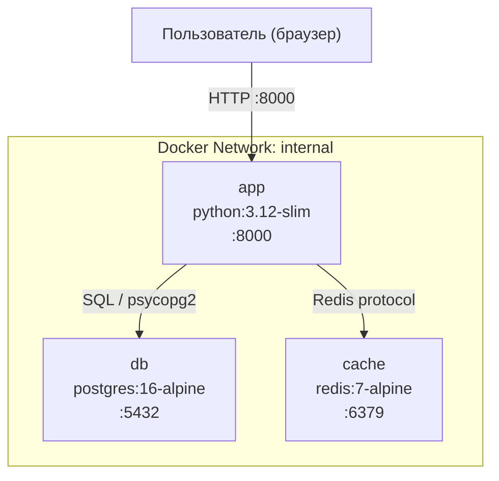

# Схема сети контейнеров — TaskFlow

## Диаграмма



## Описание сети

Все три сервиса находятся в изолированной bridge-сети `internal`. Наружу (на хост-машину) пробрасывается только порт `8000` сервиса `app` — БД и Redis недоступны извне.

| Сервис | Образ | Порт внутри сети | Порт на хосте |
| ------ | ----- | ---------------- | -------------- |
| `app` | `python:3.12-slim` | 8000 | 8000 |
| `db` | `postgres:16-alpine` | 5432 | — |
| `cache` | `redis:7-alpine` | 6379 | — |

## Volumes

| Volume | Смонтирован в | Назначение |
| ------ | ------------- | ---------- |
| `postgres_data` | `/var/lib/postgresql/data` | Персистентное хранение данных БД между перезапусками |

## Запуск

```bash
docker-compose up -d
```
