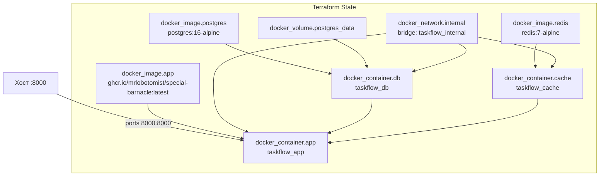

# Схема инфраструктуры — Terraform

## Граф ресурсов

## Порядок создания ресурсов

1. `docker_network.internal` — сеть создаётся первой
2. `docker_volume.postgres_data` — том независим от контейнеров
3. `docker_container.db` — зависит от сети и тома
4. `docker_container.cache` — зависит от сети
5. `docker_container.app` — зависит от db и cache (`depends_on`)

Terraform автоматически определяет порядок по графу зависимостей и создаёт независимые ресурсы параллельно.

## Сеть

Все три контейнера подключены к сети `taskflow_internal` (bridge). Снаружи доступен только порт `8000` приложения. PostgreSQL и Redis не публикуют порты на хост.
